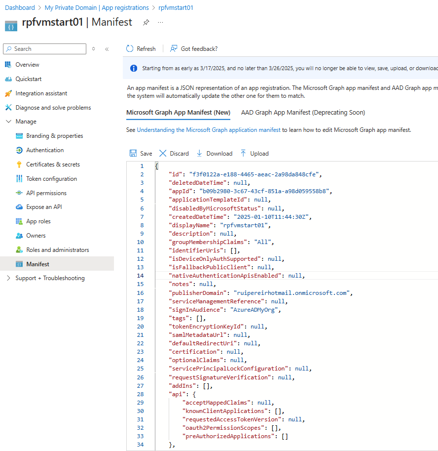

# Web App for Azure VM start self-service

This web app allows users to start Azure VMs in a slef-service approach. It is a simple Node.js app that uses the Azure SDK to interact with Azure VM resources an it's secured with Microsoft Entra ID. Only authenticated users that belong to a well defined and configurable set of security groups can access the application and execute operations. 

## Contents

| File/folder   | Description                                                                                    |
|---------------|------------------------------------------------------------------------------------------------|
| `scripts/`    | Contains Azure CLIS and bash scripts to automate zure reasource creation and app registration. |
| `app/`        | Web application sources.                                                                       |
| `docs/`       | Documentation and illustrations.                                                               |


## Setup

### Deploy Azure resources

You can use the provided script `scripts\create-azure-env.sh`. Copy the file `scripts\sample.env` to a new file named `scripts\.env`, customize the values for your specific Azure scenario and run it:

```bash
cd scripts
./create-azure-env.sh
```

### Register the app in Azure Entra ID


## Run locally

To test it locally, 

If you want to test locally, you can run the app with the following commands:

```bash
cd app
node server.js
```

## Containerize

You can build a Docker image and test it locally with the following command:

```bash
docker build -t web-vm-start .
docker run -d -p 3000:3000 web-vm-start
```

## Authz

https://learn.microsoft.com/en-us/azure/active-directory/hybrid/how-to-connect-fed-group-claims#configure-the-azure-ad-application-registration-for-group-attributes

before:  




## Deployment

## TODO

- [ ] Deploy in ACI
- [ ] Test with ACI


- [ ] Review README.md
- [ ] Test with managed identity